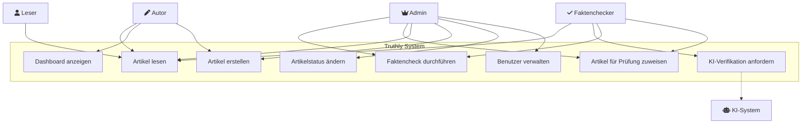
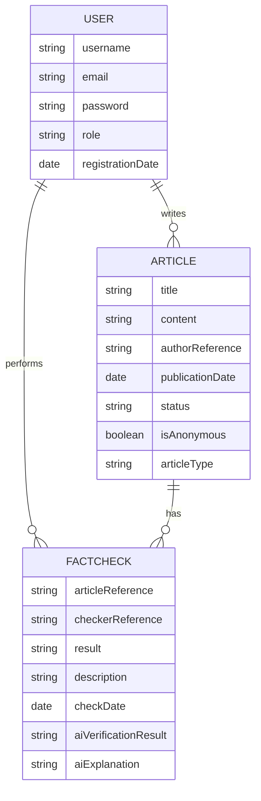
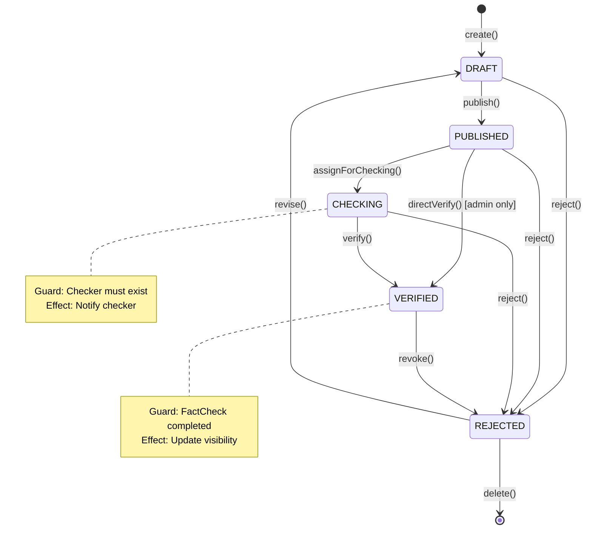

# Truthly - Unabhängige News-Plattform mit KI-gestützten Faktenchecks

Eine sichere, transparente und community-getriebene Nachrichtenplattform für unabhängigen Journalismus mit integrierter Faktenprüfung.

[](./target/site/jacoco/index.html)
[](https://github.com/yourusername/truthly/actions)

# Inhaltsverzeichnis
- [Einleitung](#einleitung)
    - [Explore-Board](#explore-board)
    - [Create-Board](#create-board)
    - [Evaluate-Board](#evaluate-board)
    - [Diskussion Feedback Pitch](#diskussion-feedback-pitch)
- [Anforderungen](#anforderungen)
    - [Use-Case Diagramm](#use-case-diagramm)
    - [Use-Case Beschreibung](#use-case-beschreibung)
    - [Fachliches Datenmodell](#fachliches-datenmodell)
    - [Erläuterungen zum Datenmodell](#erläuterungen-zum-datenmodell)
    - [Zustandsdiagramm](#zustandsdiagramm)
    - [UI-Mockup](#ui-mockup)
- [Implementation](#implementation)
    - [Frontend](#frontend)
    - [KI-Funktionen](#ki-funktionen)
- [Fazit](#fazit)
    - [Stand der Implementation](#stand-der-implementation)
    
# Einleitung

## Explore-Board
### TRENDS & TECHNOLOGIE
- **Künstliche Intelligenz (KI)**: Automatisierte Faktenchecks mithilfe eines KI-Modells über die Spring AI-API.
- **Cloud-Native Architektur**: Deployment auf Azure App Service mit MongoDB Atlas für Skalierbarkeit.
- **Progressive Web App (PWA)**: SvelteKit-basiertes Frontend für optimale Performance.
- **OAuth2/OIDC**: Sichere Authentifizierung über Auth0 mit rollenbasierter Zugriffskontrolle.
- **CI/CD Pipeline**: Automatisiertes Testing und Deployment via GitHub Actions.
- **RESTful API**: Standardisierte Schnittstellen für maximale Interoperabilität.

### POTENTIELLE PARTNER & WETTBEWERB
**Wettbewerber:**
- Traditionelle Nachrichtenportale (Spiegel, BBC, The Guardian)
- Faktencheck-Plattformen (Snopes, PolitiFact)
- Alternative Medienplattformen (Substack, Medium)

**Potenzielle Partner:**
- Faktencheck-Organisationen (Correctiv, Mimikama)
- NGOs für unabhängigen Journalismus
- Technologie-Partner (MongoDB, Auth0, Azure)

### FAKTEN
- **Tech Stack**: Spring Boot 3.4 + MongoDB + SvelteKit
- **Deployment**: Azure App Service mit Docker
- **Security**: OAuth2 mit Auth0, rollenbasierte Zugriffskontrolle
- **Testing**: JUnit 5 mit Mockito, Testcontainers für Integrationstests
- **4 Benutzerrollen**: USER, AUTHOR, FACT_CHECKER, ADMIN
- **3 Hauptentitäten**: User, Article, FactCheck

### POTENZIALFELDER
- **Vertrauenswürdige Berichterstattung**: KI-gestützte Faktenchecks
- **Anonymer Journalismus**: Schutz für investigative Reporter
- **Community-Engagement**: Bewertungen und Kommentare
- **Transparenz**: Nachvollziehbare Faktenchecks

### USER
**Leser (USER):**
- Konsumieren verifizierte Nachrichten
- Suchen unabhängige Berichterstattung

**Journalisten (AUTHOR):**
- Publizieren Artikel (anonym möglich)
- Verfolgen Status ihrer Artikel

**Faktenchecker (FACT_CHECKER):**
- Überprüfen eingereichte Artikel
- Arbeiten mit KI-Unterstützung

**Administratoren (ADMIN):**
- Verwalten Benutzer und Plattform
- Überwachen Systemintegrität

### BEDÜRFNISSE
- Zugang zu faktenbasierten, unabhängigen Nachrichten
- Schutz für Journalisten bei brisanten Themen
- Effiziente Faktenprüfung mit KI-Unterstützung
- Transparente Bewertungsprozesse

### ERKENNTNISSE
- Fake News sind eine wachsende Herausforderung
- KI kann bei der Faktenprüfung unterstützen, ersetzt aber nicht menschliche Expertise
- Anonymität ist wichtig für investigativen Journalismus
- Community-Vertrauen entsteht durch Transparenz

### TOUCHPOINTS
- **Web-App**: Hauptplattform für alle Nutzerinteraktionen
- **API**: RESTful Services für Integration
- **Admin-Dashboard**: Verwaltungsoberfläche
- **E-Mail**: Benachrichtigungen über Statusänderungen

### WIE KÖNNEN WIR?
- Wie können wir KI sinnvoll in den Faktencheck-Prozess integrieren?
- Wie können wir Anonymität gewährleisten und trotzdem Qualität sichern?
- Wie können wir die Plattform nachhaltig finanzieren?

## Create-Board
### IDEEN-BESCHREIBUNG
Truthly ist eine **Spring Boot-basierte News-Plattform** mit integriertem **KI-gestütztem Faktencheck-System**. 

Die Plattform ermöglicht:
- **Artikelerstellung** durch verifizierte Autoren
- **Anonyme Veröffentlichung** für sensible Themen
- **KI-Vorprüfung** aller Artikel auf Glaubwürdigkeit
- **Menschliche Verifikation** durch Faktenchecker
- **Transparente Statusverfolgung** (Draft → Published → Checking → Verified/Rejected)

### ADRESSIERTE NUTZER
📖 **Leser**
- Wollen verlässliche, geprüfte Nachrichten
- Interessieren sich für unabhängige Berichterstattung

📝 **Journalisten/Autoren**
- Benötigen sichere Publikationsmöglichkeiten
- Wollen Feedback zu ihren Artikeln

✅ **Faktenchecker**
- Brauchen effiziente Tools zur Verifikation
- Wollen KI-Unterstützung bei der Prüfung

### ADRESSIERTE BEDÜRFNISSE
✔️ **Verlässlichkeit** – Alle Artikel durchlaufen einen Verifikationsprozess  
✔️ **Sicherheit** – Anonyme Publikation möglich  
✔️ **Effizienz** – KI-Vorprüfung beschleunigt Faktenchecks  
✔️ **Transparenz** – Klarer Artikelstatus-Workflow  

### PROBLEME
1. **Informationsflut**: Schwer zu unterscheiden zwischen Fakten und Fiktion
2. **Zeitdruck**: Manuelle Faktenchecks sind zeitaufwändig
3. **Sicherheitsrisiken**: Journalisten brauchen Schutz

### IDEENPOTENZIAL
**Mehrwert**: 🔵🔵🔵🔵🔵🔵⚪️⚪️⚪️⚪️  
→ Kombination von KI und menschlicher Expertise ist einzigartig

**Übertragbarkeit**: 🔵🔵🔵🔵🔵🔵🔵⚪️⚪️⚪️  
→ Technologie kann für verschiedene Sprachen/Märkte adaptiert werden

**Machbarkeit**: 🔵🔵🔵🔵🔵🔵🔵🔵🔵⚪️  
→ Bereits implementiert mit Spring Boot, MongoDB und Mock-KI

### DAS WOW
🤖 **"KI trifft Journalismus – für Wahrheit in Echtzeit!"**  
🔍 **"Faktenchecks auf Knopfdruck – transparent und nachvollziehbar!"**  

### HIGH-LEVEL-KONZEPT
**"GitHub für Journalismus – mit eingebautem Faktencheck"**

### WERTVERSPRECHEN
**"Truthly bietet eine technologisch fortschrittliche Plattform, die KI-gestützte Faktenchecks mit menschlicher Expertise kombiniert, um verlässlichen Journalismus zu gewährleisten."**

## Evaluate-Board

### 📢 KANÄLE
- **GitHub Repository** – Open Source Entwicklung
- **Azure Deployment** – Produktive Instanz
- **Postman Dokumentation** – API für Entwickler
- **Auth0** – Sichere Benutzerauthentifizierung

### 🔐 UNFAIRER VORTEIL
- **Spring Boot Expertise**: Robuste Enterprise-Architektur
- **MongoDB Aggregation**: Komplexe Datenanalysen möglich
- **Auth0 Integration**: Enterprise-Grade Security
- **Testabdeckung**: Hohe Codequalität durch umfangreiche Tests

### 📊 KPI (Key Performance Indicators)
- **Artikel pro Monat**: Anzahl publizierter Artikel
- **Faktencheck-Rate**: Prozentsatz geprüfter Artikel
- **KI-Genauigkeit**: Übereinstimmung KI vs. menschliche Prüfer
- **Response Time**: API-Performance unter Last
- **Test Coverage**: Aktuell ~85% (Ziel: 90%)

### 💰 EINNAHMEQUELLEN
- **Freemium-Modell**: Basis-Zugang kostenlos
- **Premium-Features**: Erweiterte Analysen für Faktenchecker
- **API-Zugang**: Für externe Integrationen
- **Institutionelle Lizenzen**: Für Medienunternehmen

## Diskussion Feedback Pitch
Nach dem Pitch in Woche 5/6 erhielten wir folgendes Feedback:

**Positive Aspekte:**
- Klare technische Vision mit Spring Boot und KI
- Gute Abgrenzung der Benutzerrollen
- Durchdachter Artikelstatus-Workflow

**Verbesserungsvorschläge:**
- KI-Integration konkreter ausarbeiten → Implementiert als Mock mit Upgrade-Pfad
- UI/UX mehr in den Fokus rücken → SvelteKit mit Bootstrap für moderne UI
- Skalierbarkeit bedenken → MongoDB Atlas und Azure App Service gewählt

# Anforderungen
## Use-Case Diagramm



## Use-Case Beschreibung

### UC4: Faktencheck durchführen

**Primärakteur**: Faktenchecker  
**Stakeholder**: Autor, Leser, Admin  
**Vorbedingungen**: 
- Faktenchecker ist authentifiziert
- Artikel existiert im Status PUBLISHED oder CHECKING

**Nachbedingungen**: 
- Artikel hat Status VERIFIED oder REJECTED
- FactCheck-Entität wurde erstellt
- KI-Bewertung wurde gespeichert

**Hauptszenario**:
1. Faktenchecker wählt zu prüfenden Artikel aus
2. System zeigt Artikelinhalt an
3. Faktenchecker fordert KI-Analyse an
4. System führt KI-Faktencheck durch und zeigt Ergebnis
5. Faktenchecker überprüft Artikel manuell
6. Faktenchecker gibt eigene Bewertung ab (TRUE/FALSE/PARTLY_TRUE/UNVERIFIABLE)
7. Faktenchecker schreibt Begründung
8. System speichert FactCheck mit KI- und Human-Bewertung
9. System aktualisiert Artikelstatus basierend auf Bewertung

**Alternativszenarien**:
- 3a. KI-Service nicht verfügbar → System verwendet Mock-Implementierung
- 6a. Bewertung stimmt nicht mit KI überein → System markiert zur Review

## Fachliches Datenmodell 



## Erläuterungen zum Datenmodell 

### Entitäten

**USER**
- Repräsentiert alle Systembenutzer
- `role` definiert Berechtigungen (USER, AUTHOR, FACT_CHECKER, ADMIN)
- `registrationDate` für Audit-Zwecke

**ARTICLE**
- Zentrale Content-Entität
- `status` durchläuft mehrere Zustände (siehe Zustandsdiagramm)
- `isAnonymous` ermöglicht anonyme Publikation
- `articleType` kategorisiert Content (NEWS, OPINION, INVESTIGATION, FACTUAL)

**FACTCHECK**
- Dokumentiert Prüfprozess
- Speichert sowohl KI- als auch Human-Bewertung
- `result` verwendet FactCheckRating enum

### Beziehungen
- **USER writes ARTICLE**: 1:n Beziehung, Autoren können mehrere Artikel schreiben
- **USER performs FACTCHECK**: 1:n Beziehung, Faktenchecker können mehrere Prüfungen durchführen
- **ARTICLE has FACTCHECK**: 1:n Beziehung, Artikel können mehrfach geprüft werden

## Zustandsdiagramm



**Events**:
- `publish()`: Autor veröffentlicht Artikel
- `assignForChecking()`: System weist Artikel zur Prüfung zu
- `verify()`: Faktenchecker bestätigt Artikel
- `reject()`: Faktenchecker/Admin lehnt Artikel ab
- `revise()`: Autor überarbeitet abgelehnten Artikel

**Guards**:
- Status-Übergänge werden validiert
- Benutzerberechtigungen werden geprüft

**Effects**:
- E-Mail-Benachrichtigungen (geplant)
- Audit-Log Einträge
- Dashboard-Updates

## UI-Mockup 

### Hauptnavigation
```
+----------------------------------------------------------+
| Truthly   [Articles] [Users] [Fact Checks] [Account] [Logout] |
+----------------------------------------------------------+
```

### Article Dashboard
```
+----------------------------------------------------------+
| Create Article                                            |
| +------------------------------------------------------+ |
| | Title: [____________________]                        | |
| | Content: [                                          ]| |
| |          [                                          ]| |
| | Author: [Dropdown]  Type: [NEWS v]  [ ] Anonymous   | |
| | [Submit]                                             | |
| +------------------------------------------------------+ |
|                                                          |
| All Articles                                             |
| +------------------------------------------------------+ |
| | Title | Author | Status | Type | Date | Actions     | |
| |-------|--------|--------|------|------|-------------|  |
| | News1 | User1  | DRAFT  | NEWS | 2025 | [Edit]      | |
| | Op1   | Anon   | VERIFIED| OPINION | 2025 | [View]  | |
| +------------------------------------------------------+ |
+----------------------------------------------------------+
```

# Implementation
## Frontend

### Login-Seite

- Auth0-Integration für sichere Authentifizierung
- E-Mail und Passwort-basiertes Login
- Link zur Registrierung

### Dashboard für Autoren

- Artikelerstellung mit Rich-Text-Editor
- Artikel-Typ Auswahl (NEWS, OPINION, etc.)
- Anonyme Publikation Option
- Übersicht aller eigenen Artikel mit Status

### Fact-Check Interface

- Zweistufiger Prozess: KI-Analyse → Menschliche Prüfung
- KI-Bewertung mit Confidence-Score
- Detaillierte Erklärungen für Bewertungen
- Vergleich KI vs. Human Rating

### User Management (Admin)

- Benutzerverwaltung mit Rollenzuweisung
- Suchfunktion
- Registrierungsdatum-Tracking

### Technische Features
- **SvelteKit + Bootstrap 5**: Modernes, responsives Design
- **Real-time Updates**: Artikel-Status wird sofort aktualisiert
- **Error Handling**: Benutzerfreundliche Fehlermeldungen
- **Loading States**: Spinner während KI-Analyse

## KI-Funktionen

### Mock AI Implementation
Die aktuelle Implementation nutzt eine Mock-KI für Faktenchecks:

```java
public AIFactCheckResult performFactCheck(String title, String content) {
    // Analyse basierend auf Keywords
    if (title.contains("fake") || content.contains("conspiracy")) {
        return new AIFactCheckResult(
            FactCheckRating.FALSE, 
            "Detected potential misinformation patterns"
        );
    }
    // Weitere Heuristiken...
}
```

### KI-Features
1. **Automatische Inhaltsanalyse**
   - Erkennung von Fake-News-Mustern
   - Bewertung der Glaubwürdigkeit
   - Confidence-Score Berechnung

2. **Rating-System**
   - TRUE: Faktenbasiert und verifizierbar
   - FALSE: Enthält Falschinformationen
   - PARTLY_TRUE: Gemischte Faktenlage
   - UNVERIFIABLE: Kann nicht verifiziert werden

3. **Erklärbare KI**
   - Detaillierte Begründungen für Bewertungen
   - Transparenz im Entscheidungsprozess

### Geplante KI-Erweiterungen
- Integration von OpenAI GPT-3.5/4 über Spring AI
- Fact-Checking gegen externe Datenbanken
- Sentiment-Analyse für Bias-Erkennung
- Quellenverifikation

# Fazit

## Stand der Implementation

### ✅ Erfolgreich implementiert:
- **Backend**: Vollständige Spring Boot REST API
- **Frontend**: SvelteKit SPA mit Bootstrap
- **Datenbank**: MongoDB Atlas Integration
- **Security**: Auth0 mit 4 Benutzerrollen
- **Testing**: ~85% Coverage mit JUnit/Mockito
- **CI/CD**: GitHub Actions → Azure App Service
- **KI-Integration**: Mock-Implementation mit Upgrade-Pfad

### 🔄 In Arbeit:
- Erhöhung der Testabdeckung auf 90%
- Verbesserung der rollenbasierten Tests
- Performance-Optimierung der Aggregationen

### 📋 Nächste Schritte (siehe [GitHub Issues](https://github.com/yourusername/truthly/issues)):
1. **#23** - E-Mail-Benachrichtigungen implementieren
2. **#24** - Echte KI-Integration mit OpenAI
3. **#25** - Erweiterte Such- und Filterfunktionen
4. **#26** - Kommentar-System für Artikel
5. **#27** - Export-Funktionen (PDF, CSV)
6. **#28** - Mehrsprachigkeit (i18n)

### Lessons Learned:
- Spring Security mit Auth0 erfordert sorgfältige Konfiguration
- Testcontainers vereinfachen MongoDB-Integrationstests erheblich
- SvelteKit bietet excellente Developer Experience
- Mock-First Entwicklung ermöglicht paralleles Frontend/Backend-Development

---

**Projektteam**: [Ihr Name]  
**Modul**: Software Engineering 2  
**Dozenten**: David, Adrian, Max, Benjamin  
**Semester**: FS25
